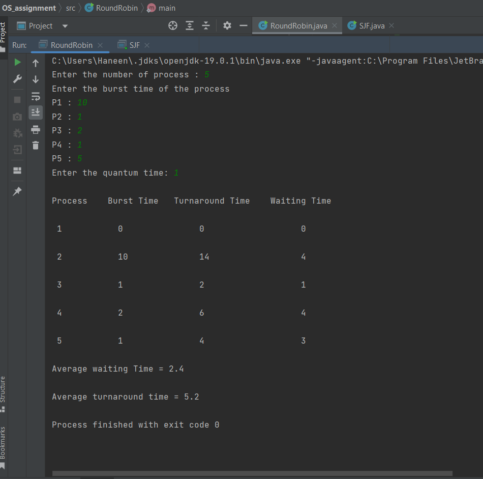

# CPU Scheduling Algorithms RR and SJFNImplementation using Java

This project contains Java Implemenation of two CPU Scheduling algorithms: Round Robin (RR) and Shortest Job First (SJF)

## RR Algorithm
Round robin is a pre-emptive algorithm
The CPU is shifted to the next process after fixed interval time, which is called time quantum. The implementation of the RR can be found here <a=href"https://github.com/haneennamr/OSAssignmnet/blob/main/OS_assignment/src/RoundRobin.java">  The program reads in the processes and outputs the waiting time, complete time and turnaround time for each process.

## SJF Algorithm
Preemptive Scheduling Algorithm is an algorithm in which the processor is allocated to the job having minimum CPU burst time, but the job can be preempted (Replaced) by a newer job with shorter burst time.  The implementation of the RR can be found here <a=href"https://github.com/haneennamr/OSAssignmnet/blob/main/OS_assignment/src/SJF.java">SJF.java</a> file. The program reads in the processes and outputs the waiting time, complete time and turnaround time for each process.

